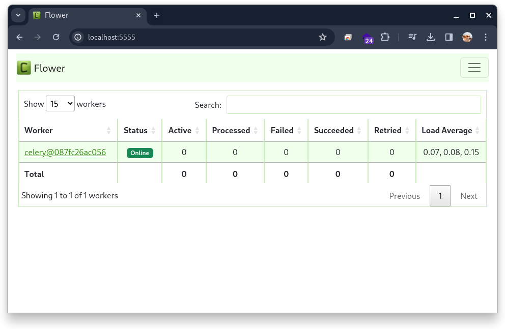
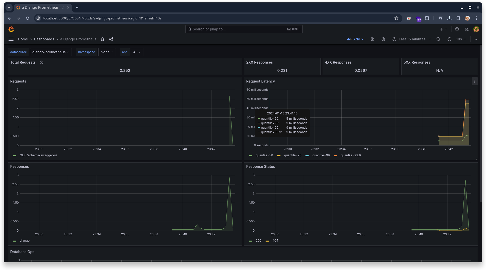

# Event Management System

A Django REST API that allows users to create organizations, events and send text messages via WebSocket. Auth system - JWT. Grafana for monitoring.

## Tech Stack

- Docker, docker-compose
- Python 3.11.5
- Django 5.0
- Django Rest Framework 3.14.0
- Django Channels 4.0.0
- PostgreSQL 15.4-alpine3.18
- Redis 7.2.1-alpine3.18
- Celery latest
- Flower latest
- Swagger (drf-yasg 1.21.7)
- Pip

## Tech Stack Monitoring

- [django-prometheus v2.3.1](https://github.com/korfuri/django-prometheus)
- Grafana
- Prometheus

## Run in Docker

Start web application and database in Docker

```commandline
docker compose up
```

```
➜  event-management git:(master) ✗ docker ps
CONTAINER ID   IMAGE                             COMMAND                  CREATED          STATUS          PORTS                    NAMES
ea4daf7b1948   mher/flower:latest                "celery flower"          32 minutes ago   Up 17 minutes   0.0.0.0:5555->5555/tcp   event_flower_container
087fc26ac056   event_celeryworker_image:latest   "/start-celeryworker"    32 minutes ago   Up 17 minutes   8000/tcp                 event_celery_container
addb833c7fd1   event_django_image:latest         "run.sh"                 32 minutes ago   Up 17 minutes   0.0.0.0:8000->8000/tcp   event_django_container
1412153bd91a   grafana/grafana-enterprise        "/run.sh"                32 minutes ago   Up 17 minutes   0.0.0.0:3000->3000/tcp   grafana
b4fdbb784dfe   redis:7.2.1-alpine3.18            "docker-entrypoint.s…"   32 minutes ago   Up 17 minutes   6379/tcp                 event_redis_container
478da6bada7e   prom/prometheus:latest            "/bin/prometheus --c…"   32 minutes ago   Up 17 minutes   0.0.0.0:9090->9090/tcp   event-management-prometheus-1
3ca5d03ac114   postgres:15.4-alpine3.18          "docker-entrypoint.s…"   32 minutes ago   Up 17 minutes   0.0.0.0:5432->5432/tcp   event-management-postgres-1
```

## App url

`localhost:8000`

Su user for admin panel is already created.

- Login `admin@admin.com`
- Password - `admin`

`localhost:8000/admin/`

Check swagger documentation

`localhost:8000/swagger/`

## Track Celery Tasks with Flower

You can track Celery tasks using Flower at [http://localhost:5555/](http://localhost:5555/)



## Monitoring. Grafana.



#### How to use

Open Grafana at `localhost:3000`:

- **Login:** `admin`
- **Password:** `admin`

Add a new datasource `Prometheus` with your name. Set Prometheus server URL to `http://prometheus:9090`. Scroll down and press `Save & Test`. Build the dashboard with `Import a dashboard`. Download JSON [here](https://grafana.com/grafana/dashboards/9528-django-prometheus/) and paste it. Enjoy!

[YouTube Tutorial](https://www.youtube.com/watch?v=MbW0jUgp3Vs)